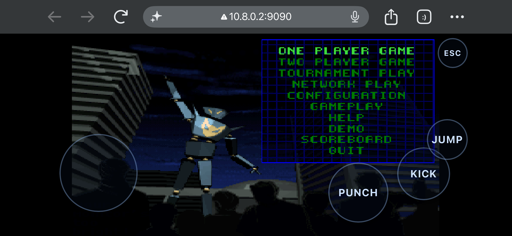

# OpenOMF Web — One Must Fall 2097 in your browser

A WebAssembly + WebGL2 port of [OpenOMF](https://github.com/omf2097/openomf),
the open-source remake of the 1994 fighting game *One Must Fall: 2097*.

Runs in any modern browser with WebGL2 support — desktop or mobile. Includes
an on-screen touch controller for phones and tablets.



## Quick start

```bash
# 1. Build (needs Docker)
./build.sh

# 2. Serve
./serve.sh

# 3. Play
# Open http://localhost:9090/openomf.html
```

That's it. The first build downloads the freeware game assets, compiles all
dependencies (SDL2, SDL2_mixer, libxmp, libconfuse, enet, zlib, libpng) to
WASM, patches the game source for WebGL2, and produces the final
`output/openomf.{html,js,wasm,data}` artifacts.

## Requirements

- **Docker** — the build runs inside the `emscripten/emsdk` container so you
  don't need to install Emscripten locally.
- **Python 3** — for the dev server (`serve.sh`).
- **A WebGL2 browser** — Chrome, Firefox, Safari 15+, Edge.

## What was changed

The original OpenOMF is a desktop C/SDL2/OpenGL 3.3 game. This repo adds the
patches and build infrastructure to cross-compile it to the web.

`openomf/` is a **git subtree** of [`omf2097/openomf`](https://github.com/omf2097/openomf)
with a small patch set applied on top. The full patch lives in
`patches/omf-web-overrides.patch` (git-applyable from the repo root).

### Keeping in sync with upstream

```bash
git subtree pull --prefix openomf https://github.com/omf2097/openomf master --squash
git apply patches/omf-web-overrides.patch   # if it no longer applies, fix the conflicts
./build.sh                                   # rebuild + retest
git add -A && git commit -m "Sync upstream; reapply web overrides" && git push
```

Upstream changes rarely touch the web layer, so the patch usually applies
unmodified; when it doesn't, the conflicts are confined to the files below.

### Source patches (`openomf/`)

| File | Change |
|---|---|
| `src/engine.c` | Refactored the blocking game loop into `emscripten_set_main_loop` so the browser stays responsive |
| `src/main.c` | Deferred `engine_close()` on Emscripten (main returns before the loop ends); forced stderr logging for diagnostics |
| `src/video/renderers/opengl3/sdl_window.c` | Request GLES 3.0 / WebGL2 context under `__EMSCRIPTEN__` instead of GL 3.3 core |
| `src/video/renderers/opengl3/helpers/vbo.c` | Emulated `glMapBufferRange` with a CPU staging buffer (WebGL2 has no buffer mapping) |
| `src/video/renderers/opengl3/helpers/object_array.c` | Unrolled `glMultiDrawArrays` into a loop (not in GLES3 core) |
| `src/video/renderers/opengl3/helpers/render_target.c` | Use `GL_RGBA16F` + `GL_FLOAT` for the paletted framebuffer (GLES3 has no normalised `GL_RGBA16`) |
| `src/audio/music_sources/opus_source.c` | Added stub `opus_load_memory` when opusfile is disabled |
| `cmake-scripts/BuildLanguages.cmake` | Run the languagetool via node cross-compiling emulator under Emscripten |
| `CMakeLists.txt` | Target-specific Emscripten link flags (WebGL2, filesystem, shell, preload); `AUTOLOAD_DYLIBS=0` for tools |
| `src/console/console.c` | Disable debug-console stdin reads on Emscripten (browser `read(0)` fires `window.prompt` dialogs) |
| `shaders/*.vert`, `shaders/*.frag` | Translated all 12 shaders from GLSL 330 core to GLSL ES 3.00 (precision qualifiers, `texture` instead of `textureLod` for `usampler2D`, moved bool initializers into `main`, etc.) |

### Build infrastructure

| File | Purpose |
|---|---|
| `build.sh` | Host entry point — ensures data exists, then launches the Docker build |
| `prepare-data.sh` | Downloads the freeware game assets and assembles `data/` |
| `serve.sh` | Dev server with correct MIME types (`.wasm` → `application/wasm`) |
| `docker/build-wasm.sh` | Runs inside the Emscripten container: builds all deps, then OpenOMF, copies artifacts |
| `docker/run-build.sh` | Docker wrapper with volume mounts |
| `shell/shell.html` | Custom HTML shell with loading screen, `ENV` setup, virtual filesystem dirs, and the touch controller |

### What's not included

- **Netplay** — ENet uses raw UDP, which browsers can't do. Single-player works
  fully; multiplayer would need a WebSocket relay bridge.
- **Opus music** — disabled to reduce build complexity. The original MOD music
  plays via libxmp.
- **Screenshots** — libpng is linked but `glReadPixels` in WebGL2 may need
  `preserveDrawingBuffer` for reliable screenshots.

## Touch controls

The on-screen controller maps to the game's keyboard inputs:

- **Left stick** — movement (up/down/left/right arrows, 8-way)
- **KICK** — Right Shift
- **PUNCH** — Enter
- **JUMP** — Arrow Up
- **ESC** — Escape (pause / back)

On desktop, the physical keyboard works as normal.

## Audio notes

- **iOS / iPadOS**: audio unlocks on the first tap. If you hear nothing, make
  sure the physical **mute switch** (above the volume buttons, or Control
  Center) is off — iOS silently mutes all web audio when it is enabled.
- Browsers require a user gesture before audio starts; the game resumes SDL's
  AudioContext on tap/click.

## Project structure

```
wasm-omf/
├── build.sh              # entry point
├── prepare-data.sh       # downloads freeware assets
├── serve.sh              # dev server
├── .gitignore
├── docker/
│   ├── build-wasm.sh     # container build script
│   └── run-build.sh      # docker wrapper
├── shell/
│   └── shell.html        # HTML shell + touch controller
├── openomf/              # patched OpenOMF source
│   ├── src/
│   ├── shaders/          # GLSL ES 3.00 shaders
│   ├── cmake-scripts/
│   ├── CMakeLists.txt
│   └── ...
├── data/                 # assembled game data (not in repo)
├── deps-src/             # downloaded dep tarballs (not in repo)
├── build/                # Docker build scratch (not in repo)
└── output/               # final web artifacts (not in repo)
```

## Credits

- [OpenOMF](https://github.com/omf2097/openomf) by Tuomas Virtanen, Andrew
  Thompson, Hunter and contributors — MIT License.
- *One Must Fall: 2097* by Diversions Entertainment (1994) — freeware.
- Build dependencies: SDL2, SDL2_mixer, libxmp, libconfuse, enet, zlib, libpng,
  libepoxy (shimmed).

## License

The patches in this repo are MIT. OpenOMF itself is MIT. The game data is
freeware from the original publisher.
